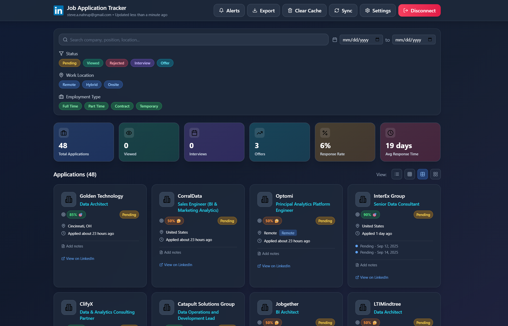
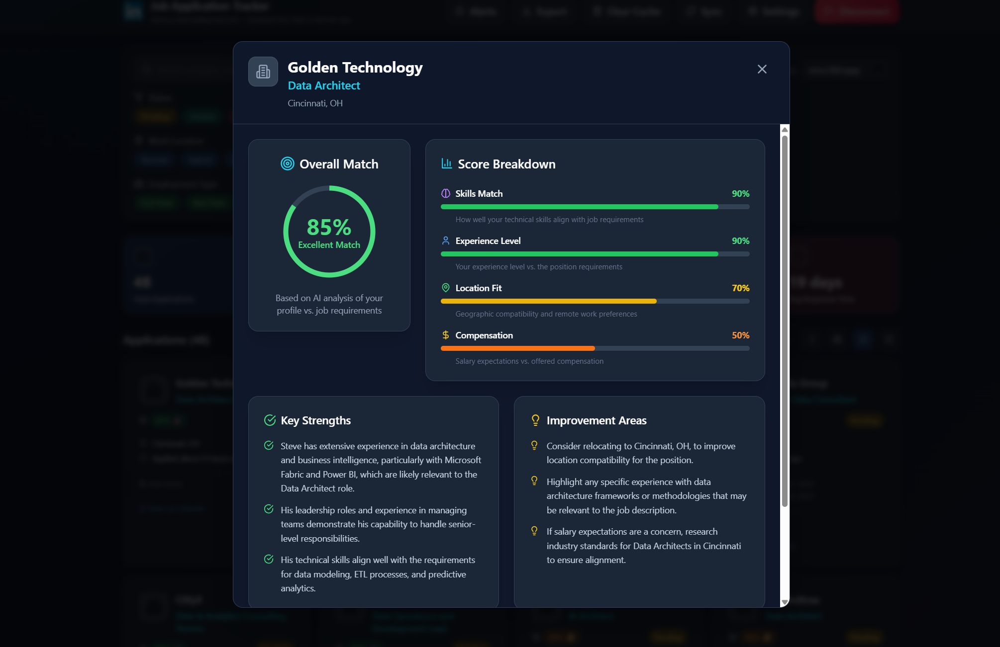

# LinkedIn Job Application Tracker with AI-Powered Insights



## 🚀 Overview

The LinkedIn Job Application Tracker is an intelligent job search management system that automatically syncs with your Gmail to track LinkedIn job applications, provides AI-powered match scoring, and offers comprehensive analytics about your job search journey.

### Why This Tool Exists

Job searching is exhausting. Between applying to dozens of positions, tracking responses, and trying to remember which companies have viewed your application, it's easy to lose track. This tool was built to solve these problems by:

- **Eliminating Manual Tracking**: No more spreadsheets - automatically imports all job applications from Gmail
- **Providing Intelligence**: Uses AI to score job matches based on your actual resume
- **Showing Real Insights**: Track view rates, response times, and application status in real-time
- **Staying Organized**: All your applications in one place with powerful filtering and search

## ✨ Key Features

### 📧 Automatic Gmail Integration
- Connects directly to your Gmail account via OAuth 2.0
- Automatically identifies and imports LinkedIn job application emails
- Tracks application status changes (Pending → Viewed → Interview → Offer/Rejected)
- Links related emails (application confirmations, "viewed" notifications, interview requests)

### 🤖 AI-Powered Intelligence
- **Smart Email Parsing**: Uses OpenAI GPT-4 to extract job details from any email format
- **Resume-Based Match Scoring**: Analyzes each position against your actual resume
- **Detailed Scoring Breakdown**:
  - Skills alignment (0-100%)
  - Experience level match (0-100%)
  - Location compatibility (0-100%)
  - Salary expectations (0-100%)
- **Actionable Insights**: Get specific suggestions for improving your candidacy



### 📊 Analytics Dashboard
- **Real-time Metrics**:
  - Total applications
  - View rate
  - Interview conversion rate
  - Average response time
- **Status Tracking**: Pending, Viewed, Interview Requested, Offer, Rejected
- **Smart Filtering**: By status, location, employment type, date range

### 🎨 Modern User Experience
- **Responsive Design**: Works perfectly on desktop, tablet, and mobile
- **Dark Mode**: Easy on the eyes during late-night job hunting
- **Multiple View Modes**: List view, card view, compact view
- **Real-time Updates**: See changes instantly as emails arrive

## 🛠️ Technical Architecture

### Why Built This Way

1. **React + TypeScript**: Type-safe, maintainable, and scales with complexity
2. **Vite**: Lightning-fast development and optimized production builds
3. **Zustand**: Simple state management without Redux boilerplate
4. **Tailwind CSS**: Rapid UI development with consistent design system
5. **OpenAI Integration**: Leverages GPT-4 for intelligent data extraction
6. **Gmail API**: Direct integration for real-time email monitoring

### Data Flow
```
Gmail Inbox → Gmail API → AI Parser (GPT-4) → Data Normalization → 
Local Storage → React UI → Match Scoring → Insights Dashboard
```

## 📦 Installation & Setup

### Prerequisites
- Node.js 18+ and npm
- Google Cloud Console account (free)
- OpenAI API key (for AI features)
- Gmail account with LinkedIn job application emails

### Step-by-Step Setup

#### 1. Clone and Install
```bash
git clone https://github.com/snahrup/linkedin-job-tracker.git
cd linkedin-job-tracker
npm install
```

#### 2. Configure OpenAI (Required for AI Features)
1. Get an API key from [OpenAI Platform](https://platform.openai.com/api-keys)
2. Copy `.env.example` to `.env.local`:
```bash
cp .env.example .env.local
```
3. Add your OpenAI API key to `.env.local`:
```
VITE_OPENAI_API_KEY=your_actual_api_key_here
```

#### 3. Set Up Google OAuth
1. Go to [Google Cloud Console](https://console.cloud.google.com/)
2. Create a new project or select existing
3. Enable Gmail API:
   - Go to "APIs & Services" → "Library"
   - Search for "Gmail API"
   - Click "Enable"
4. Create OAuth 2.0 credentials:
   - Go to "APIs & Services" → "Credentials"
   - Click "Create Credentials" → "OAuth client ID"
   - Choose "Web application"
   - Add authorized JavaScript origins:
     - `http://localhost:3000` (for development)
     - Your production URL (if deploying)
   - Copy the Client ID

#### 4. Add Google Client ID
1. Open the app at `http://localhost:3000`
2. Click "Settings" (gear icon)
3. Paste your Google OAuth Client ID
4. Save settings

#### 5. Start Using
```bash
npm run dev
```
Open [http://localhost:3000](http://localhost:3000)

## 📖 How to Use

### Initial Setup
1. **Connect Gmail**: Click "Connect Gmail" and authorize access
2. **First Sync**: Click "Sync" to import all job application emails
3. **View Results**: Applications appear automatically with AI-calculated match scores

### Daily Workflow
1. **Check Dashboard**: See new views, responses, and status changes
2. **Review Match Scores**: Focus on high-scoring opportunities
3. **Track Progress**: Monitor response rates and timing patterns
4. **Export Data**: Download CSV for additional analysis

### Understanding Match Scores
- **90-100%** 🎯: Perfect match - prioritize these!
- **70-89%** ✅: Strong match - definitely apply/follow up
- **50-69%** 🤔: Moderate match - consider with improvements
- **Below 50%** ⚠️: Weak match - may need significant changes

### Pro Tips
- **Clear Cache**: Use when emails aren't linking properly
- **Demo Mode**: Test the interface with sample data
- **Filters**: Combine multiple filters for precise searches
- **Export**: Regular backups of your job search data

## 🔧 Troubleshooting

### Common Issues

**"Unknown Position" appearing:**
- Click "Clear Cache" then "Sync" to reprocess with latest AI

**Gmail not connecting:**
- Ensure Gmail API is enabled in Google Cloud Console
- Check that redirect URIs match exactly
- Try using an incognito window

**Match scores not appearing:**
- Verify OpenAI API key is set in `.env.local`
- Check browser console for API errors

**Applications not linking:**
- The system matches by LinkedIn URL or Company+Position
- "Clear Cache" forces complete reprocessing

## 🚀 Deployment

### Deploy to Vercel (Recommended)
```bash
npm run build
vercel deploy
```

### Deploy to Netlify
```bash
npm run build
netlify deploy --dir=dist
```

Remember to:
- Set environment variables in your hosting platform
- Update OAuth redirect URIs in Google Cloud Console
- Use HTTPS in production

## 📊 Features Roadmap

- [ ] Calendar integration for interview scheduling
- [ ] Email templates for follow-ups
- [ ] Salary negotiation insights
- [ ] Company research integration
- [ ] Mobile app version
- [ ] Team/collaborative features

## 🤝 Contributing

Contributions are welcome! Please:
1. Fork the repository
2. Create a feature branch
3. Commit your changes
4. Push to the branch
5. Open a Pull Request

## 📄 License

MIT License - feel free to use this for your job search!

## 🙏 Acknowledgments

Built with frustration from my own job search and a desire to help others navigate the process more effectively. Special thanks to the open source community for the amazing tools that made this possible.

---

**Built by [Steve Nahrup](https://linkedin.com/in/steve-nahrup)** | **[GitHub](https://github.com/snahrup)**

*Good luck with your job search! 🎯*
